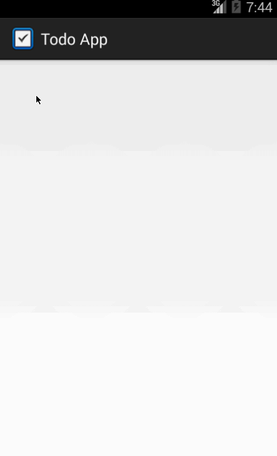

# Android Bootcamp: Building the Android Todo App

This is an Android application for tracking a todo list. See the [Todo Prework](https://gist.github.com/nesquena/843228e83fdc4f5ddc4e).

Time spent: 4+6+3=13 hours spent in total

Completed user stories:

 * [x] Required: user can *view* a list of existing todo items.
 * [x] Required: User can *add* a new item to the todo list.
 * [x] Required: User can *remove* an item from the todo list.
 * [x] Required: User can *edit* an item by pressing and edit in new activity.
 * [x] Required: Data is persisted to storage.
 * [x] Optional: Use a DialogFragment instead of new Activity to support editing items.
 * [x] Optional: Add support for completion due dates for items. 
 * [x] Optional: Change the item in ListView to display additional attributes. Used "Customizing Android ListView Rows by Subclassing" pattern.
 * [x] Optional: Tweak the style of the app, improve UI.
 * [x] Optional: Persist the todo app in SQLite instead of using a text file
 
Walkthrough of all user stories:

GIF created with [LiceCap](http://www.cockos.com/licecap/).

