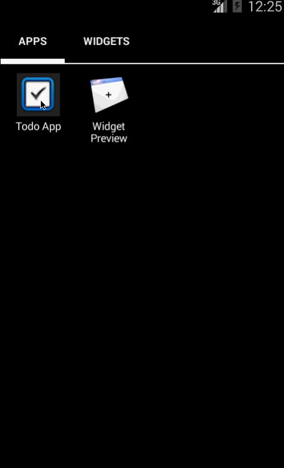

# Android Bootcamp Pre-work: Building the Android Todo App

This is an Android demo application for tracking a todo list. See the [Todo Preword](https://gist.github.com/nesquena/843228e83fdc4f5ddc4e).

Time spent: 4 hours spent in total

Completed user stories:

 * [x] Required: user can *view* a list of existing todo items.
 * [x] Required: User can *add* a new item to the todo list.
 * [x] Required: User can *remove* an item from the todo list.
 * [x] Required: User can *edit* an item by pressing and edit in new activity.
 * [x] Required: Data is persisted to storage.
 
Walkthrough of all user stories:

GIF created with [LiceCap](http://www.cockos.com/licecap/).

